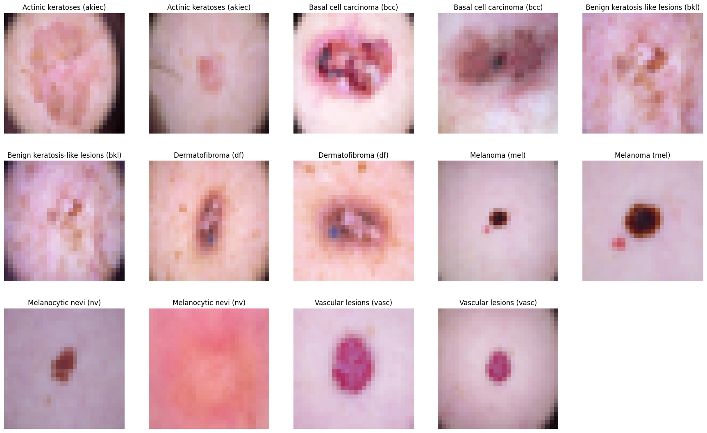
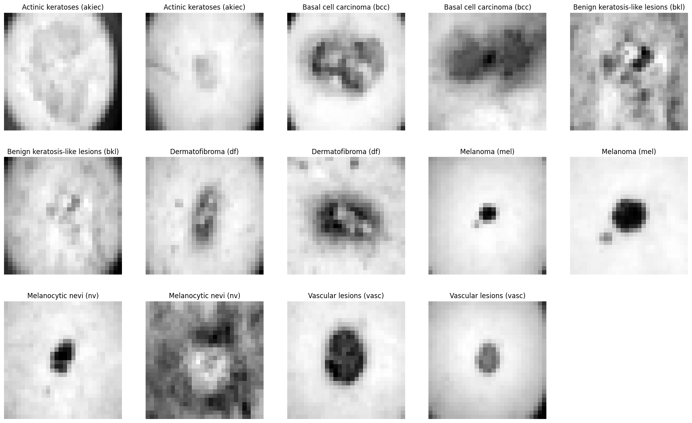
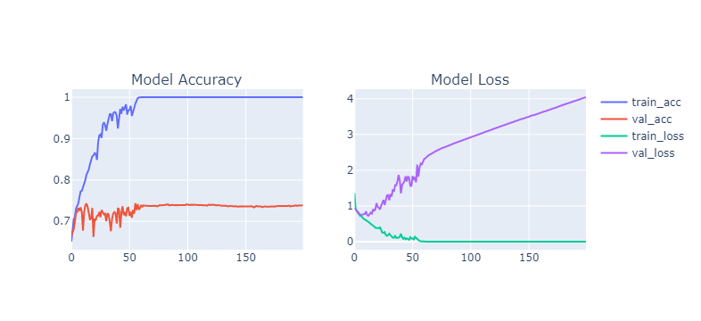
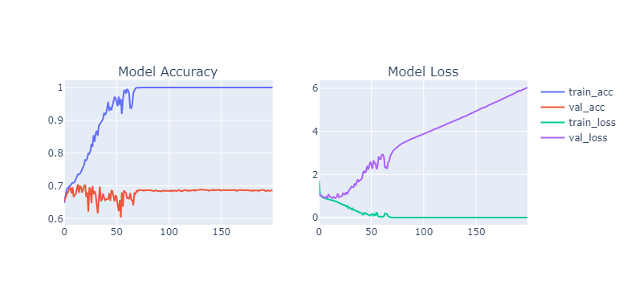
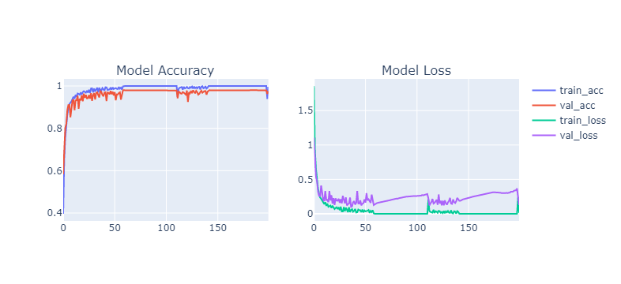
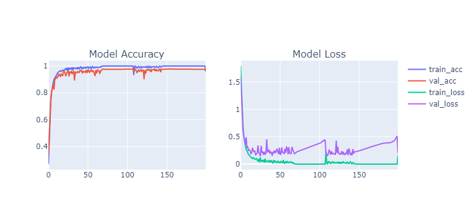

# Introduction

Skin cancer is the most common type of cancer. It is the growth of abnormal skin cells on skin exposed to the sun. This type of cancer also can also occur in areas not exposed to sunlight. The most common places for skin cancer to develop are on areas of skin that are exposed to the sun, including the scalp, face, lips, ears, neck, chest, arms and hands, and on the legs in women. However, it can also form in areas that are rarely seen in the light of day: palms, under fingernails or toenails, and areas of the genitals. Currently, deep learning has revolutionised the future as it can solve complex problems. The motivation is to develop a solution that can help dermatologists better support their diagnostic accuracy by ensembling contextual images , reducing the variance of predictions from the model.


# Problem

Early detection is critical for successful treatment, but accurately identifying the type of skin cancer can be challenging. That's where skin classification using CNN multiclass classification comes in. By training a neural network on a large dataset of skin cancer images, we can develop a highly accurate classification system that can differentiate between the 7 different types of skin cancer.

This approach solves several key problems in skin cancer detection. First, it eliminates the need for a human expert to visually inspect every skin lesion, which can be time-consuming and prone to error. Second, it can help identify subtle differences between different types of skin cancer that might not be apparent to the naked eye. And third, it can help ensure that patients receive the correct diagnosis and treatment plan, improving their chances of a positive outcome.

Overall, skin classification using CNN multiclass classification is a powerful tool for improving the accuracy and efficiency of skin cancer detection. By leveraging the power of machine learning, we can help healthcare providers make more informed decisions and ultimately improve patient outcomes.

# Motivation 

The primary goal of the project is to develop a highly accurate skin cancer classification model using CNN multiclass classification. By training the neural network on a large dataset of skin cancer images, the model aims to differentiate between all seven types of skin cancer with high precision and accuracy.

The project's focus on accuracy and validation based on images is essential in ensuring that healthcare providers have access to reliable and accurate skin cancer diagnosis tools. The model's ability to accurately classify skin cancer types can aid in identifying the disease in its early stages, leading to more effective treatment and improved patient outcomes.

Overall, the project's focus on developing an accurate skin cancer classification model using advanced image classification technology is a significant step towards improving skin cancer detection and diagnosis, leading to earlier treatment and better patient outcomes.

# Dataset 

The HAM10000 dataset is commonly used in skin cancer classification tasks due to its extensive collection of 10,015 dermatoscopic images of pigmented skin lesions, which are classified into seven different types. The dataset provides a representative range of the major diagnostic categories of skin lesions, including Actinic keratoses and intraepithelial carcinoma/Bowen's disease (akiec), basal cell carcinoma (bcc), benign keratosis-like lesions such as solar lentigines/seborrheic keratoses and lichen-planus like keratosis (bkl), dermatofibroma (df), melanoma (mel), melanocytic nevi (nv), and vascular lesions such as angiomas, angiokeratomas, pyogenic granulomas, and haemorrhage, vasc.

By using this dataset in skin cancer classification tasks, researchers and practitioners can train and test models to accurately differentiate between the various types of skin cancer. The diversity of the dataset allows for a more comprehensive understanding of skin lesions and better support for dermatological clinical work.

<div>
<style scoped>
    .dataframe tbody tr th:only-of-type {
        vertical-align: middle;
    }

    .dataframe tbody tr th {
        vertical-align: top;
    }

    .dataframe thead th {
        text-align: right;
    }
</style>
<table border="1" class="dataframe">
  <thead>
    <tr style="text-align: right;">
      <th></th>
      <th>lesion_id</th>
      <th>image_id</th>
      <th>dx</th>
      <th>dx_type</th>
      <th>age</th>
      <th>sex</th>
      <th>localization</th>
    </tr>
  </thead>
  <tbody>
    <tr>
      <th>0</th>
      <td>HAM_0000118</td>
      <td>ISIC_0027419</td>
      <td>bkl</td>
      <td>histo</td>
      <td>80.0</td>
      <td>male</td>
      <td>scalp</td>
    </tr>
    <tr>
      <th>1</th>
      <td>HAM_0000118</td>
      <td>ISIC_0025030</td>
      <td>bkl</td>
      <td>histo</td>
      <td>80.0</td>
      <td>male</td>
      <td>scalp</td>
    </tr>
    <tr>
      <th>2</th>
      <td>HAM_0002730</td>
      <td>ISIC_0026769</td>
      <td>bkl</td>
      <td>histo</td>
      <td>80.0</td>
      <td>male</td>
      <td>scalp</td>
    </tr>
    <tr>
      <th>3</th>
      <td>HAM_0002730</td>
      <td>ISIC_0025661</td>
      <td>bkl</td>
      <td>histo</td>
      <td>80.0</td>
      <td>male</td>
      <td>scalp</td>
    </tr>
    <tr>
      <th>4</th>
      <td>HAM_0001466</td>
      <td>ISIC_0031633</td>
      <td>bkl</td>
      <td>histo</td>
      <td>75.0</td>
      <td>male</td>
      <td>ear</td>
    </tr>
  </tbody>
</table>
</div>

# Sample Images from Dataset 



# Data Pre-Procesing

1. Merging Images with Metadata: Since you have metadata associated with each image, you can merge the two by matching the image ID in the metadata to the image file name. This will help you to leverage the metadata information to improve your classification model.

2. Converting Images to Grayscale: Since color may not be a distinguishing factor for skin lesion classification, you can convert all images to grayscale to reduce the dimensionality of the data and improve the model's performance.

3. Resizing Images: You can resize all images to a standardized size of 28x28 pixels, which is small enough to speed up the training process but large enough to retain important details of the skin lesion. This will also help to reduce the computational overhead and improve the model's efficiency.

4. Balancing the Dataset: Since the dataset may be imbalanced, you can use oversampling techniques to balance the number of images in each class. This can be done by duplicating the images in the minority class or by generating synthetic images using techniques such as data augmentation. By balancing the dataset, you can prevent the model from being biased towards the majority class and improve its overall performance.

Overall, by following these data preprocessing steps, you can prepare your skin cancer classification dataset for training the neural network model using CNN multiclass classification, which can improve the accuracy and reliability of the model's predictions.

```python
base_skin_dir = os.path.join('..', "SkinCancer")

# Merging images from both folders HAM10000_images_part1.zip and HAM10000_images_part2.zip into one dictionary

imageid_path_dict = {os.path.splitext(os.path.basename(x))[0]: x
                     for x in glob(os.path.join(base_skin_dir,'*', '*.jpg'))}
lesion_type_dict = {
    'nv': 'Melanocytic nevi (nv)',
    'mel': 'Melanoma (mel)',
    'bkl': 'Benign keratosis-like lesions (bkl)',
    'bcc': 'Basal cell carcinoma (bcc)',
    'akiec': 'Actinic keratoses (akiec)',
    'vasc': 'Vascular lesions (vasc)',
    'df': 'Dermatofibroma (df)'
}
label_mapping = {
    0: 'nv',
    1: 'mel',
    2: 'bkl',
    3: 'bcc',
    4: 'akiec',
    5: 'vasc',
    6: 'df'
}
reverse_label_mapping = dict((value, key) for key, value in label_mapping.items())
```


```python
data = pd.read_csv('HAM10000_metadata.csv')

# Creating New Columns for better readability

# data['path'] = data['image_id'].map(imageid_path_dict.get)
# data['cell_type'] = data['dx'].map(lesion_type_dict.get) 
# data['cell_type_idx'] = pd.Categorical(skin_df['cell_type']).codes

```

```python
data.describe(exclude=[np.number])
```


<div>
<style scoped>
    .dataframe tbody tr th:only-of-type {
        vertical-align: middle;
    }

    .dataframe tbody tr th {
        vertical-align: top;
    }

    .dataframe thead th {
        text-align: right;
    }
</style>
<table border="1" class="dataframe">
  <thead>
    <tr style="text-align: right;">
      <th></th>
      <th>lesion_id</th>
      <th>image_id</th>
      <th>dx</th>
      <th>dx_type</th>
      <th>sex</th>
      <th>localization</th>
    </tr>
  </thead>
  <tbody>
    <tr>
      <th>count</th>
      <td>10015</td>
      <td>10015</td>
      <td>10015</td>
      <td>10015</td>
      <td>10015</td>
      <td>10015</td>
    </tr>
    <tr>
      <th>unique</th>
      <td>7470</td>
      <td>10015</td>
      <td>7</td>
      <td>4</td>
      <td>3</td>
      <td>15</td>
    </tr>
    <tr>
      <th>top</th>
      <td>HAM_0003789</td>
      <td>ISIC_0027419</td>
      <td>nv</td>
      <td>histo</td>
      <td>male</td>
      <td>back</td>
    </tr>
    <tr>
      <th>freq</th>
      <td>6</td>
      <td>1</td>
      <td>6705</td>
      <td>5340</td>
      <td>5406</td>
      <td>2192</td>
    </tr>
  </tbody>
</table>
</div>


```python
data.count().isna()
```


    lesion_id       False
    image_id        False
    dx              False
    dx_type         False
    age             False
    sex             False
    localization    False
    dtype: bool
```python
# Adding cell_type and image_path columns
data['cell_type'] = data['dx'].map(lesion_type_dict.get)
data['path'] = data['image_id'].map(imageid_path_dict.get)
```


```python
data.head()
```


<div>
<style scoped>
    .dataframe tbody tr th:only-of-type {
        vertical-align: middle;
    }

    .dataframe tbody tr th {
        vertical-align: top;
    }

    .dataframe thead th {
        text-align: right;
    }
</style>
<table border="1" class="dataframe">
  <thead>
    <tr style="text-align: right;">
      <th></th>
      <th>lesion_id</th>
      <th>image_id</th>
      <th>dx</th>
      <th>dx_type</th>
      <th>age</th>
      <th>sex</th>
      <th>localization</th>
      <th>cell_type</th>
      <th>path</th>
    </tr>
  </thead>
  <tbody>
    <tr>
      <th>0</th>
      <td>HAM_0000118</td>
      <td>ISIC_0027419</td>
      <td>bkl</td>
      <td>histo</td>
      <td>80</td>
      <td>male</td>
      <td>scalp</td>
      <td>Benign keratosis-like lesions (bkl)</td>
      <td>../SkinCancer/Images1/ISIC_0027419.jpg</td>
    </tr>
    <tr>
      <th>1</th>
      <td>HAM_0000118</td>
      <td>ISIC_0025030</td>
      <td>bkl</td>
      <td>histo</td>
      <td>80</td>
      <td>male</td>
      <td>scalp</td>
      <td>Benign keratosis-like lesions (bkl)</td>
      <td>../SkinCancer/Images1/ISIC_0025030.jpg</td>
    </tr>
    <tr>
      <th>2</th>
      <td>HAM_0002730</td>
      <td>ISIC_0026769</td>
      <td>bkl</td>
      <td>histo</td>
      <td>80</td>
      <td>male</td>
      <td>scalp</td>
      <td>Benign keratosis-like lesions (bkl)</td>
      <td>../SkinCancer/Images1/ISIC_0026769.jpg</td>
    </tr>
    <tr>
      <th>3</th>
      <td>HAM_0002730</td>
      <td>ISIC_0025661</td>
      <td>bkl</td>
      <td>histo</td>
      <td>80</td>
      <td>male</td>
      <td>scalp</td>
      <td>Benign keratosis-like lesions (bkl)</td>
      <td>../SkinCancer/Images1/ISIC_0025661.jpg</td>
    </tr>
    <tr>
      <th>4</th>
      <td>HAM_0001466</td>
      <td>ISIC_0031633</td>
      <td>bkl</td>
      <td>histo</td>
      <td>75</td>
      <td>male</td>
      <td>ear</td>
      <td>Benign keratosis-like lesions (bkl)</td>
      <td>../SkinCancer/Images2/ISIC_0031633.jpg</td>
    </tr>
  </tbody>
</table>
</div>


```python
# Converting Images Into  Gray scale Numpy array
data['image_pixel'] = data['path'].map(lambda x: np.asarray(Image.open(x).convert('L').resize((28,28))))

```


```python
data['image_pixel'].shape
```


    (10015,)
```python
# Displaying 2 images for each label
sample_data = data.groupby('dx').apply(lambda df: df.iloc[:2, [9, 7]])
plt.figure(figsize=(22, 32))
for i in range(14):
    plt.subplot(7, 5, i + 1)
    plt.imshow(np.squeeze(sample_data['image_pixel'][i] ),cmap = 'gray')
    img_label = sample_data['cell_type'][i]
    plt.title(img_label)
    plt.axis("off")
plt.show();
```


    

    

```python
# Adding image pixels
data['image_pixel'] = data['path'].map(lambda x: np.asarray(Image.open(x).resize((28,28))))
```


```python
data.head(5)
```


<div>
<style scoped>
    .dataframe tbody tr th:only-of-type {
        vertical-align: middle;
    }

    .dataframe tbody tr th {
        vertical-align: top;
    }

    .dataframe thead th {
        text-align: right;
    }
</style>
<table border="1" class="dataframe">
  <thead>
    <tr style="text-align: right;">
      <th></th>
      <th>lesion_id</th>
      <th>image_id</th>
      <th>dx</th>
      <th>dx_type</th>
      <th>age</th>
      <th>sex</th>
      <th>localization</th>
      <th>cell_type</th>
      <th>path</th>
      <th>image_pixel</th>
    </tr>
  </thead>
  <tbody>
    <tr>
      <th>0</th>
      <td>HAM_0000118</td>
      <td>ISIC_0027419</td>
      <td>bkl</td>
      <td>histo</td>
      <td>80</td>
      <td>male</td>
      <td>scalp</td>
      <td>Benign keratosis-like lesions (bkl)</td>
      <td>../SkinCancer/Images1/ISIC_0027419.jpg</td>
      <td>[[[192, 153, 193], [195, 155, 192], [197, 154,...</td>
    </tr>
    <tr>
      <th>1</th>
      <td>HAM_0000118</td>
      <td>ISIC_0025030</td>
      <td>bkl</td>
      <td>histo</td>
      <td>80</td>
      <td>male</td>
      <td>scalp</td>
      <td>Benign keratosis-like lesions (bkl)</td>
      <td>../SkinCancer/Images1/ISIC_0025030.jpg</td>
      <td>[[[27, 16, 32], [69, 49, 76], [122, 93, 126], ...</td>
    </tr>
    <tr>
      <th>2</th>
      <td>HAM_0002730</td>
      <td>ISIC_0026769</td>
      <td>bkl</td>
      <td>histo</td>
      <td>80</td>
      <td>male</td>
      <td>scalp</td>
      <td>Benign keratosis-like lesions (bkl)</td>
      <td>../SkinCancer/Images1/ISIC_0026769.jpg</td>
      <td>[[[192, 138, 153], [200, 144, 162], [202, 142,...</td>
    </tr>
    <tr>
      <th>3</th>
      <td>HAM_0002730</td>
      <td>ISIC_0025661</td>
      <td>bkl</td>
      <td>histo</td>
      <td>80</td>
      <td>male</td>
      <td>scalp</td>
      <td>Benign keratosis-like lesions (bkl)</td>
      <td>../SkinCancer/Images1/ISIC_0025661.jpg</td>
      <td>[[[40, 21, 31], [95, 61, 73], [143, 102, 118],...</td>
    </tr>
    <tr>
      <th>4</th>
      <td>HAM_0001466</td>
      <td>ISIC_0031633</td>
      <td>bkl</td>
      <td>histo</td>
      <td>75</td>
      <td>male</td>
      <td>ear</td>
      <td>Benign keratosis-like lesions (bkl)</td>
      <td>../SkinCancer/Images2/ISIC_0031633.jpg</td>
      <td>[[[159, 114, 140], [194, 144, 173], [215, 162,...</td>
    </tr>
  </tbody>
</table>
</div>

# Model Evaluation and Deployment

The same model architecture is used for both types of images. The model takes input images with a size of 28x28 pixels, regardless of whether they are in grayscale or RGB format.

During the data preprocessing step, the images are converted to grayscale using standard techniques, such as averaging the RGB channels. Then, the images are resized to a fixed size of 28x28 pixels.

After preprocessing, the images are fed into the CNN model, which consists of four convolutional layers followed by three dense layers. The convolutional layers learn important features from the images, while the dense layers classify the images into one of the 7 different types of skin cancer.

The model architecture consists of four convolutional layers and three dense layers.

The first layer is a convolutional layer with 16 filters and a kernel size of 3x3. This layer is followed by a max pooling layer with a pool size of 2x2. The second and third layers are similar to the first layer, with 32 and 64 filters respectively. The fourth layer is a convolutional layer with 128 filters and a kernel size of 3x3, followed by another max pooling layer.

The output of the final max pooling layer is then flattened into a 1D array, and passed through three dense layers with 64, 32, and 7 neurons respectively. The last dense layer has 7 neurons, corresponding to the 7 different types of skin cancer that the model is trained to classify.

The total number of parameters in the model is 132,583, which is a relatively small number for a CNN model. The model is trained to minimize the cross-entropy loss function, and the optimizer used is not specified in the model summary.

Overall, the same CNN architecture is used for both grayscale and RGB images, with only the input data format changing.

    Model: "sequential"
    _________________________________________________________________
     Layer (type)                Output Shape              Param #   
    =================================================================
     conv2d (Conv2D)             (None, 28, 28, 16)        448       
                                                                     
     max_pooling2d (MaxPooling2D  (None, 14, 14, 16)       0         
     )                                                               
                                                                     
     conv2d_1 (Conv2D)           (None, 14, 14, 32)        4640      
                                                                     
     max_pooling2d_1 (MaxPooling  (None, 7, 7, 32)         0         
     2D)                                                             
                                                                     
     conv2d_2 (Conv2D)           (None, 7, 7, 64)          18496     
                                                                     
     max_pooling2d_2 (MaxPooling  (None, 4, 4, 64)         0         
     2D)                                                             
                                                                     
     conv2d_3 (Conv2D)           (None, 4, 4, 128)         73856     
                                                                     
     max_pooling2d_3 (MaxPooling  (None, 2, 2, 128)        0         
     2D)                                                             
                                                                     
     flatten (Flatten)           (None, 512)               0         
                                                                     
     dense (Dense)               (None, 64)                32832     
                                                                     
     dense_1 (Dense)             (None, 32)                2080      
                                                                     
     dense_2 (Dense)             (None, 7)                 231       
                                                                     
    =================================================================
    Total params: 132,583
    Trainable params: 132,583
    Non-trainable params: 0
    _________________________________________________________________

# Model Training Process

This is a function for training a given CNN model on a dataset consisting of X_train and Y_train. Here's a breakdown of the different parameters and what they do:

model: This parameter takes in the CNN model that you want to train.
X_train: This is the input data for the model, which is typically a set of images.
Y_train: This is the output labels for the input data, which specifies the classification of each image.
EPOCHS: This parameter specifies the number of times the model will train on the entire dataset.
The train_model function uses the fit method from the Keras library to train the CNN model. The fit method takes in the following parameters:

X_train: The input data for the model.
Y_train: The output labels for the input data.
validation_split: This parameter specifies the percentage of the training data to use as validation data during training. In this case, 20% of the training data is used for validation.
batch_size: This parameter specifies the number of samples that the model processes at once during training. In this case, the model processes 64 samples at once.
epochs: This parameter specifies the number of times the model will train on the entire dataset.
The train_model function returns the training history of the model, which includes information about the loss and accuracy of the model during each epoch of training.

## **RGB**



## **GrayScale**


# Testing the Model

To evaluate the performance of the trained model, we use the test_model function. This function takes in the trained model, the test data X_test, and the corresponding ground truth labels Y_test.

First, it prints the accuracy of the model on the test set. It then computes the predicted labels for the test data using the model.predict function, and generates a classification report using the classification_report function from the sklearn.metrics module.

Finally, it displays a sample of 15 test images along with their true labels and predicted labels using the imshow function from the matplotlib.pyplot module.

To further evaluate the model's performance, we  use the create_confusion_matrix function. This function computes the confusion matrix for the model's predictions on the test set using the confusion_matrix function from the sklearn.metrics module. It then plots the confusion matrix using the plot_confusion_matrix function, which visualizes the true and predicted labels for each class.

Both of these functions provide useful information on the performance of the model, and  used to identify areas where the model may need improvement.

## RGB

Test Accuracy: 76.086%
    63/63 [==============================] - 0s 1ms/step
                  precision    recall  f1-score   support
    
              nv       0.87      0.91      0.89      1374
             mel       0.47      0.41      0.44       205
             bkl       0.52      0.44      0.48       227
             bcc       0.49      0.60      0.54        94
           akiec       0.32      0.27      0.29        55
            vasc       0.78      0.50      0.61        28
              df       0.50      0.15      0.23        20
    
        accuracy                           0.76      2003
       macro avg       0.56      0.47      0.50      2003
    weighted avg       0.75      0.76      0.75      2003
    


    


## **GrayScale**

 Test Accuracy: 69.995%
    63/63 [==============================] - 0s 1ms/step
                  precision    recall  f1-score   support
    
              nv       0.81      0.89      0.85      1374
             mel       0.35      0.29      0.32       205
             bkl       0.38      0.31      0.34       227
             bcc       0.39      0.32      0.35        94
           akiec       0.24      0.18      0.21        55
            vasc       0.00      0.00      0.00        28
              df       0.33      0.15      0.21        20
    
        accuracy                           0.70      2003
       macro avg       0.36      0.31      0.33      2003
    weighted avg       0.66      0.70      0.68      2003

# Balancing 

After testing our model, we noticed that some classes had more images than others. To ensure that our model is not biased towards any particular class, we decided to balance our dataset by oversampling each class so that they have a similar number of images.

Now that our data is balanced, we can train our model on the new dataset to improve its performance.

## Training the Model based on Balanced Dataset
## RGB 


## Gray Scale


## Testing the Model based on Balanced Dataset 
## RGB 
Test Accuracy: 96.755%
    63/63 [==============================] - 0s 1ms/step
                  precision    recall  f1-score   support
    
              nv       1.00      0.95      0.98      1374
             mel       0.86      1.00      0.93       205
             bkl       0.92      1.00      0.96       227
             bcc       0.90      1.00      0.95        94
           akiec       0.98      1.00      0.99        55
            vasc       0.97      1.00      0.98        28
              df       1.00      1.00      1.00        20
    
        accuracy                           0.97      2003
       macro avg       0.95      0.99      0.97      2003
    weighted avg       0.97      0.97      0.97      2003

## Gray Scale
 Test Accuracy: 94.159%
    63/63 [==============================] - 0s 1ms/step
                  precision    recall  f1-score   support
    
              nv       1.00      0.92      0.96      1374
             mel       0.84      0.97      0.90       205
             bkl       0.83      0.98      0.90       227
             bcc       0.85      1.00      0.92        94
           akiec       0.92      1.00      0.96        55
            vasc       0.88      1.00      0.93        28
              df       0.87      1.00      0.93        20
    
        accuracy                           0.94      2003
       macro avg       0.88      0.98      0.93      2003
    weighted avg       0.95      0.94      0.94      2003


# Challenges

One of the biggest challenges we faced during this project was the limited computing resources we had. Our local machines had low specs and no GPU, which made training deep learning models very slow and impractical. To overcome this limitation, we tried using Google Colab, which provides free access to GPU and TPU resources, but we still faced issues with long training times and occasional disconnections.

To address this issue, we decided to use an **AWS EC2 instance** with a more powerful GPU. We chose the g4dn.xlarge instance type, which comes with an NVIDIA T4 GPU and 16 GB of memory. We also used the **Deep Learning AMI GPU with TensorFlow 2.12.0 (Ubuntu 20.04) 20230324** as our AMI to ensure that all the necessary deep learning frameworks and libraries were pre-installed.

While using an EC2 instance helped us speed up our training times significantly, it also came with additional costs that needed to be considered. Therefore, we had to be mindful of our resource usage and make sure to terminate our instances when we were done with our work to avoid unnecessary charges.

# Future Work 

One potential direction for future work is to explore the effects of image augmentation on the model's performance. Instead of oversampling, image augmentation can be used to generate additional training samples by applying transformations to existing images such as rotation, translation, zoom, etc. This approach can improve the model's ability to generalize to new images and reduce overfitting.

Another potential area of research could be to explore different pre-trained models such as ResNet, VGG, or EfficientNet and see how they perform on our dataset. These pre-trained models have been shown to achieve state-of-the-art performance on various computer vision tasks, and may potentially improve our model's accuracy.

Lastly, we can also explore the use of transfer learning, where a pre-trained model is fine-tuned on our specific dataset. This approach can potentially improve the model's performance and reduce the training time required to achieve a high level of accuracy.

# Conclusion 

Based on our results, it seems that using RGB color images rather than grayscale images improved the overall accuracy of the skin lesion classification model. This could be due to the fact that skin tone can vary significantly among different individuals, and this color information is important for accurate classification.

Additionally, when we used oversampling to address the imbalanced class problem, the model's accuracy improved significantly for both RGB and grayscale images. This indicates that oversampling was a successful technique for improving the model's ability to identify minority classes.

It would be interesting to further explore the effects of other techniques, such as image augmentation, on the performance of the model. Overall, our results suggest that using a combination of techniques to address imbalanced classes and incorporating color information can help improve the accuracy of skin lesion classification models.


